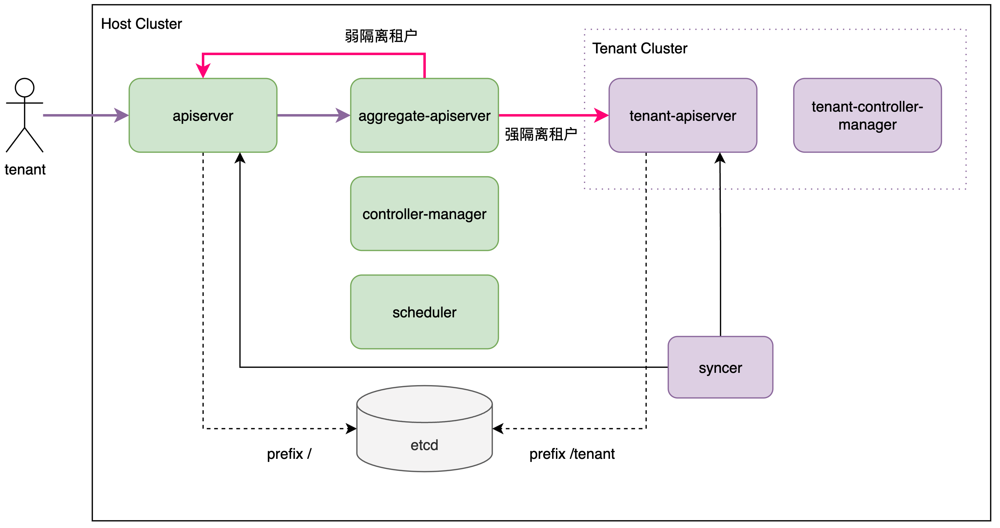

# multi-tenants

## Concepts

- Tenant: tenant k8s cluster
- Project: k8s namespace
- Application: k8s deployment

## Milestone

multi tenants within one cluster

| release | feature                                                      |
| :------ | :----------------------------------------------------------- |
| v0.1.0  | tenant cluster define, includes certificate、deployment、service、kubeconfig |
| v0.1.1  | define Tenant CRD to manage tenant cluster                   |
| v0.1.2  | tenant syncer, sync spec from tenant cluster to host cluster & status from host cluster to tenant cluster |
| v0.1.3  | aggregate apiserver in host cluster, unify all traffic       |